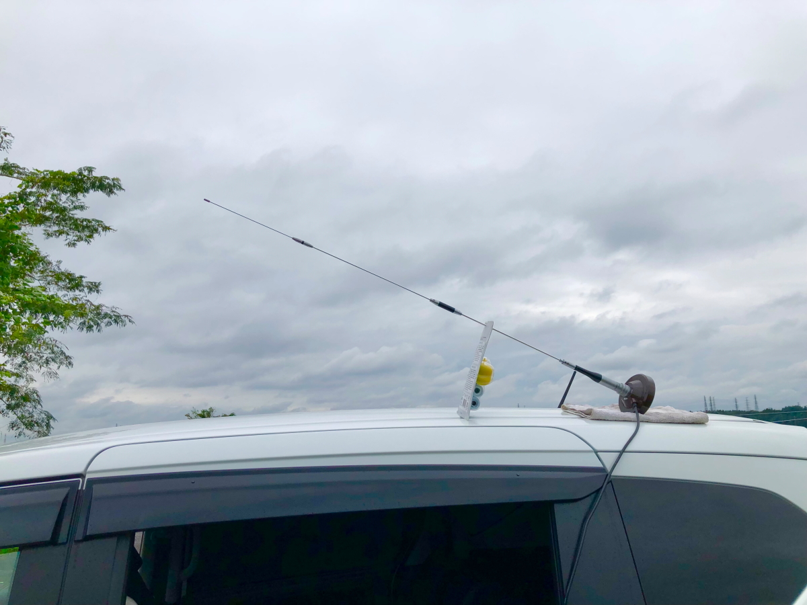

# access-test2
<html lang="ja">
 <head>
  <meta charset="utf-8" />
	 

<link href="https://cdnjs.cloudflare.com/ajax/libs/lightbox2/2.7.1/css/lightbox.css" rel="stylesheet">
 
</head>
<body>

  モバイル端末をお使いの場合は、画面を横向きにすると
  より見やすくご覧頂けます。

	

<a href="https://torokoid.github.io/access-test">access-test</a>>access-test2

	
<!—表題の表示、背景黄色、流れ文字の例—>
<h1><marquee behavior="alternate">!!! GPアンテナ、給電点高さ違い、傾きでの性能比較 !!!</marquee></h1>
	
                                       

<h2>宇都宮のハムショップノードまで約10km弱の距離から、アクセステスト。</h2>

<h2>トランクリッドをノード局側に向けています。 屋根上のアンテナはややゲインが落ちますが、これで効果が無ければ、屋根にあげる価値なしとします。</h2>

<h3>SG7500とSG7900のカタログデータ。</h3>

	
<h2>屋根上だと、S3でアクセスしました。</h2>
	
<h2>アンテナを寝せた状態でのアクセステスト、流石にこれではアクセスしませんでした。</h2>

<h2>アンテナの寝せ方を電波がノード局方向に出る様にした状態でのアクセステスト。</h2>

<h2>寝せた状態だと、S1でアクセスしました。</h2>

<h2>最後にトランクリッドのSG7900でアクセステスト こちらもS1でアクセスしました。</h2>
	
<iframe width="560" height="315" src="https://www.youtube.com/embed/F1DE_HqGI5U" title="YouTube video player" frameborder="0" allow="accelerometer; autoplay; clipboard-write; encrypted-media; gyroscope; picture-in-picture" allowfullscreen></iframe>	

<h1>結果は給電点を上げれば効果がある。 ただしアンテナ長さを克服するために寝るとやはりSが落ちる。 短いアンテナを屋根上にあげるテストはできていないが、 SG7500の垂直置きでもS1 → S3で、Sが2しか上がらないので、 短いアンテナでは期待薄。 結論：しばらくはトランクリッドのSG9700で行きますかね〜！。</h1>	

                                       

<marquee direction="left" scrollamount="5" width="85%">以上、ここまでご覧いただき、ありがとうございました！ (^_^)/~hada</marquee>

  

 

<!-- フッタ -->
 <footer>
 Copyright 2021/09/03 S.Hada
	 </footer>
